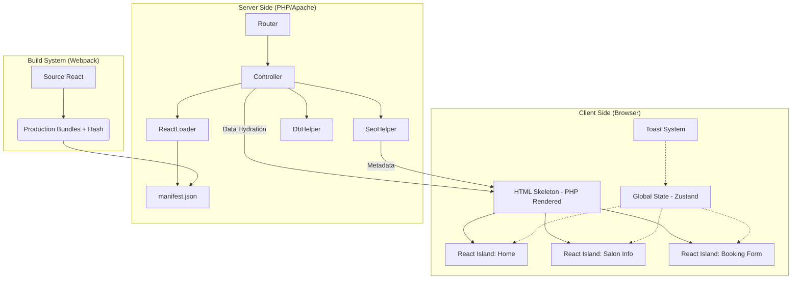

# 🏗️ Nail360 Hybrid Pro V3 - Architect & TeamLead Blueprint

Tài liệu này dành riêng cho **TeamLead** và **Hệ thống sư**. Nó giải trình các quyết định kiến trúc cốt lõi, tầm nhìn dài hạn và hướng dẫn vận hành chuyên sâu của bộ khung Hybrid Pro V3.

---

## 🛰️ 1. Tầm nhìn & Chiến lược Kiến trúc

### Tại sao lại chọn Hybrid (PHP + React Islands)?
Đa số ứng dụng hiện nay chọn hướng SPA (Single Page App) thuần túy. Tuy nhiên, với đặc thù của Nail360:
1.  **SEO là sống còn**: Các trang Salon cần được Google Index ngay lập tức với đầy đủ nội dung (SSR).
2.  **Tương tác phức tạp**: Booking Form và Real-time Notification cần React để mượt mà.
3.  **Di sản (Legacy)**: Tận dụng được hạ tầng PHP hiện có mà không phải đập đi xây lại 100%.

**=> Giải pháp: Island Architecture (Kiến trúc Hòn đảo)**
Server (PHP) render khung xương HTML chuẩn SEO. Các vùng tương tác "nóng" sẽ được React nạp vào dưới dạng các "Hòn đảo" độc lập.

### Mô phỏng Kiến trúc (Architecture Diagram)



---

## 🛠️ 2. Dependencies & Core Stack (Lý do chọn lựa)

### Frontend (React App)
- **Zustand**: Quản lý State toàn cục siêu nhẹ (thay cho Redux). Dùng để đồng bộ các Island (ví dụ: bấm nút ở Island A, hiện Toast ở Island B).
- **React Query (TanStack)**: Quản lý fetching & caching. Tự động sync dữ liệu và xử lý trạng thái Loading/Error cực chuyên nghiệp.
- **Zod**: Validation schema cho cả API và Form. Đảm bảo dữ liệu luôn đúng "hợp đồng", chặn đứng lỗi `undefined`.
- **Axios**: HTTP Client với Interceptor để xử lý Token tập trung.
- **Tailwind CSS**: Utility-first CSS giúp UI đồng nhất và cực kỳ linh hoạt.

### Backend (PHP Bridge)
- **ReactLoader Class**: Bộ não điều phối việc nhúng script. Tự động đọc Hash từ manifest để giải quyết triệt để lỗi cache trình duyệt.
- **SeoHelper Class**: Quản lý thẻ Meta, OpenGraph, Twitter Cards và JSON-LD tự động. (Đã nạp sẵn logic SEO Pro).
- **DbHelper Class**: Lớp trừu tượng hóa Database. Hiện tại đang ở dạng Mock Data để cung cấp dữ liệu cho SEO và Hydration.

---

## 🚀 3. Hướng dẫn Setup Hệ thống (Detailed)

### Bước 1: Môi trường Server & Domain
- Yêu cầu PHP 7.4+ (Khuyến nghị 8.0).
- **Document Root**: Phải trỏ thẳng vào thư mục gốc của dự án (nơi có file `index.php`).
- **Domain**: Khi chạy trên `domain.com`, hệ thống sẽ tự động nhận diện là môi trường **Production**.
- Apache/Nginx hỗ trợ URL Rewrite (đã cấu hình sẵn trong `.htaccess`).

### Bước 2: Cài đặt Node.js & Webpack
```bash
cd ReactApp
npm install
```

### Bước 3: Cấu hình .env (Cực kỳ quan trọng)
Tạo file `.env` trong thư mục `ReactApp`:
- `BUILD_TARGET`: Liệt kê các file entry cần build (ví dụ: `home,SalonDetail`). Giúp build nhanh hơn khi chỉ tập trung vào 1 module.

### Bước 4: Chế độ Phát triển (Watch Mode)
```bash
npm run start
```
*Lưu ý: Chế độ này sẽ chạy Webpack Dev Server ở port 3000 và ghi Manifest ra đĩa để PHP nạp được.*

### Bước 5: Build Production
```bash
npm run build
```
Lệnh này sẽ dọn dẹp thư mục `public/assets/react/` và sinh ra các file có Hash (ví dụ: `home.a1b2c3d4.js`).

---

## 🔐 4. Checklist Bảo mật & Tính năng

### 🛡️ Bảo mật (Security)
- [x] **Secure Token Flow**: Access Token lưu trong bộ nhớ (In-memory), Refresh Token dùng HttpOnly Cookie. Chống XSS và CSRF.
- [x] **Data Sanitation**: Toàn bộ dữ liệu nhúng từ PHP qua React được `json_encode` an toàn.
- [x] **Input Validation**: Zod kiểm soát mọi đầu vào của API, không tin tưởng dữ liệu từ Client.

### ✨ Tính năng (Performance)
- [x] **Data Hydration**: PHP bơm dữ liệu ban đầu trực tiếp. React nạp xong là có dữ liệu ngay (Zero Skeleton Screen).
- [x] **Parallel Regions**: Các Island nạp song song, lỗi vùng này không sập vùng kia.
- [x] **Error Boundaries**: Hiển thị Fallback UI đẹp mắt khi một vùng bị crash.
- [x] **Auto Formatting**: Husky + Prettier ép buộc format code trước khi Commit.

---

## 📒 5. Example Code Patterns

### Cách tạo một React Island mới
1. Tạo Component trong `src/modules/`.
2. Tạo Entry file trong `src/entries/[ten-entry].js`.
3. Đăng ký trong `views/pages/[page].php`:
```php
<!-- Div root -->
<?php ReactLoader::renderIsland('my-root-id', 'class-css'); ?>

<!-- Load script bundle -->
<?php ReactLoader::loadScripts('ten-entry'); ?>
```

### Cách nạp Dữ liệu từ PHP (Hydration)
Trong file PHP, định nghĩa biến Global trước khi nạp script:
```html
<script>
    window.__INITIAL_DATA__ = <?php echo json_encode($data); ?>;
</script>
```

---

## 🧭 6. Quy trình vận hành cho TeamLead
1. **Quản lý Package**: Luôn dùng `npm install` để đồng bộ thư viện. Tránh cài ad-hoc.
2. **Review Code**: Kiểm tra các `Zod Schema` để đảm bảo API không bị vỡ khi DB thay đổi.
3. **Build Check**: Khi deploy Production, LUÔN LUÔN chạy `npm run build` và kiểm tra `manifest.json`.

---

## 🌐 7. Cấu hình Production (Deployment)

Khi đưa lên máy chủ thực tế (VPS/Cloud), bạn không thể dùng port 8000. Dưới đây là hướng dẫn để chạy trên `http://domain.com`:

### A. Cấu hình Apache (VirtualHost)
**Lưu ý quan trọng**: Bạn phải trỏ `DocumentRoot` vào thư mục `public` của dự án, KHÔNG phải thư mục gốc. Việc này giúp bảo mật các mã nguồn PHP, file `.env` và `includes/` không bị truy cập trực tiếp từ trình duyệt.

```apache
<VirtualHost *:80>
    ServerName domain.com
    # TRỎ VÀO THƯ MỤC PUBLIC
    DocumentRoot /var/www/html/nail360-hybrid/public
    
    <Directory /var/www/html/nail360-hybrid/public>
        AllowOverride All
        Require all granted
    </Directory>
</VirtualHost>
```

### B. Cấu hình Nginx
```nginx
server {
    listen 80;
    server_name domain.com;
    # TRỎ VÀO THƯ MỤC PUBLIC
    root /var/www/html/nail360-hybrid/public;
    index index.php;

    location / {
        try_files $uri $uri/ /index.php?$query_string;
    }
    # ... các cấu hình PHP-FPM giữ nguyên
}
```

### C. Có cần lệnh để "Run Server" không?
- **Tại Local (Development)**: Bạn có thể chạy lệnh nhanh sau để test:
  `php -S localhost:8000 -t public`
- **Tại Production**: **KHÔNG CẦN LỆNH NÀO CẢ**. 
  Sau khi bạn cấu hình Apache hoặc Nginx như trên, Web Server sẽ luôn chạy ngầm (as a service). Bất cứ lúc nào khách truy cập `domain.com`, Server sẽ tự động gọi `index.php` bên trong thư mục `public` để xử lý.

### D. Cơ chế nhận diện môi trường trong ReactLoader
Class `ReactLoader` đã được thiết kế thông minh:
- Nếu cổng là 8000/9000: Coi là môi trường **Local Dev**.
- Nếu cổng là 80/443 (mặc định của domain.com): Coi là môi trường **Production**.
- **Quan trọng**: Tại Production, hệ thống sẽ KHÔNG nạp từ port 3000 mà luôn luôn đọc từ `public/assets/react/manifest.json`. Vì vậy, bạn **BẮT BUỘC** phải chạy `npm run build` trước khi deploy.

### D. Checklist trước khi "Go-Live"
1. [ ] Chạy `npm run build` để sinh asset có mã hash.
2. [ ] Kiểm tra file `.htaccess` đã tồn tại ở thư mục gốc.
3. [ ] Đảm bảo thư mục `public/assets/react` có quyền Đọc (Read) cho User của Web Server (www-data).
4. [ ] Cấu hình SSL (HTTPS) để bảo mật cho hệ thống Token.

---
**Nail360 Hybrid Pro V3** - *Kiến trúc bền vững cho tương lai. 🚀*
