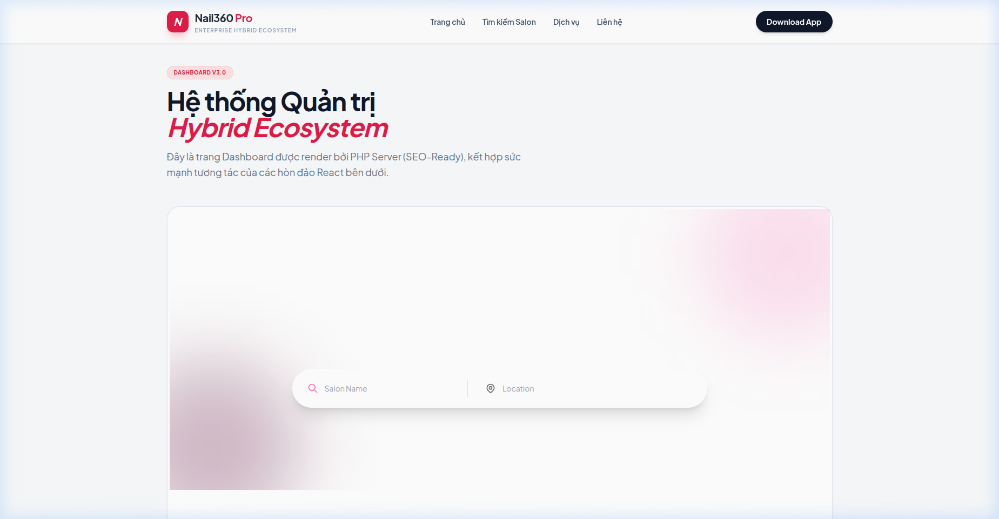
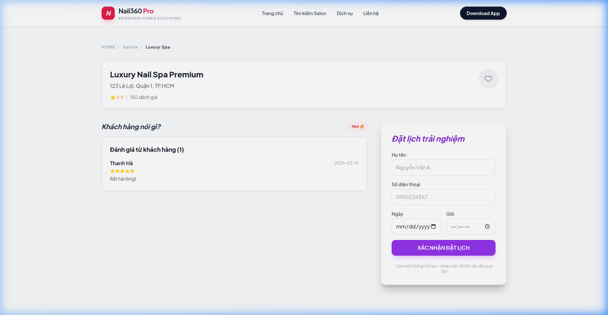
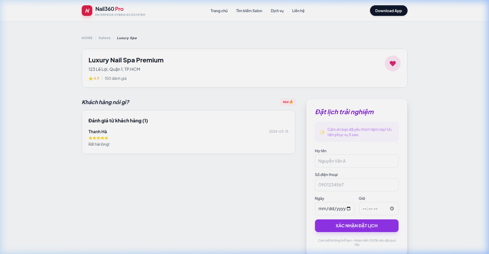

# 💅 Nail360 Starter Hybrid

Bộ khung (Starter Template) này được thiết kế để giải quyết triệt để các hạn chế của cấu trúc Hybrid cũ trong dự án Nail360. Nó kết hợp giữa **PHP Backend truyền thống** và **React Micro-Bundle hiện đại** theo tiêu chuẩn Enterprise.

---

## 📘 Tài liệu Chuyên sâu (Quick Links)
Để nắm bắt dự án nhanh nhất, vui lòng đọc các tài liệu hướng dẫn theo vai trò:
- 🏗️ [**README-SETUP.md** (Dành cho TeamLead)](README-SETUP.md): Hướng dẫn cấu hình Server, Domain, Nginx/Apache và Kiến trúc hệ thống.
- 🐣 [**README-DEV.md** (Dành cho Developer)](README-DEV.md): Hướng dẫn luồng dữ liệu (Hydration), Quy tắc Code (Zod, Zustand) và cách thêm tính năng mới.

---


1. **Cache-busting Tự Động:** Webpack build băm mã Hash vào tên file. Tạm biệt tình trạng dính cache cũ.
2. **Auto Manifest Bridge:** PHP dùng Class `ReactLoader` (được code sẵn) để tự đọc `manifest.json` và nhúng đúng file hash.
3. **Vendor Spliting:** Tách `React`, `ReactDOM` ra file `vendor.js` dùng chung, giúp file component cực nhẹ.
4. **Chuẩn SEO 100%:** Class `SeoHelper` quản lý Meta tags, Title, Description cực kì gọn gàng.
5. **Parallel Regions (Islands):** Chia trang thành nhiều vùng React độc lập. Một vùng lỗi không làm sập cả trang.
6. **Error Boundaries:** Cô lập lỗi Runtime, hiển thị giao diện dự phòng (Fallback) thay vì màn hình trắng.
7. **Data Hydration:** PHP "bơm" dữ liệu JSON trực tiếp vào HTML. **Tốc độ Zero-Loading**, không còn vòng xoay chờ API.
8. **React Query (Caching):** Tự động Cache và Sync dữ liệu giữa các "Hòn đảo" React.
9. **Zod Schema Validation:** Kiểm soát dữ liệu API bằng "Hợp đồng", chặn đứng lỗi `undefined` cấp độ runtime.
10. **Component Lazy Loading:** Chỉ tải code khi người dùng thực sự cần (vùng Reviews, Maps...), giúp tối ưu First Contentful Paint.
11. **Atomic UI Library:** Bộ thành phần `Button`, `Card` chuẩn chỉnh giúp Junior code nhanh và đồng bộ.

---

## 📂 3. Sơ đồ Thư mục Chi tiết (Map hệ thống)

```text
.(root folder)
├── includes/                   # 🧠 TRẠM ĐIỀU KHIỂN PHP (BACKEND LOGIC)
│   ├── Classes/                # Thư viện hệ thống
│   │   ├── ReactLoader.php     # Nạp file JS, Proxy Port 3000 (Dev Mode)
│   │   ├── SeoHelper.php       # Quản lý SEO Pro (Title, Meta, Social, Twitter)
│   │   └── DbHelper.php        # 🗄️ Giả lập & Kết nối Database (Mock/Real)
│   └── Services/               # Nghiệp vụ (Business Logic)
│       └── AuthService.php     # JWT, RefreshToken (HttpOnly Cookie)
│
├── views/                      # 🎨 LAYOUT & GIAO DIỆN PHP
│   ├── layout/                 # Khung chung (Header, Footer)
│   └── pages/                  # Layout từng trang (Vỏ bọc cho React Islands)
│
├── public/                     # 🌐 CỬA NGÕ CÔNG KHAI (DOC ROOT)
│   ├── index.php               # Router chính, xử lý SEO ban đầu
│   ├── api/                    # Endpoint JSON phục vụ React
│   └── assets/react/           # [Build] Nơi lưu file JS sau đóng gói
│
└── ReactApp/                   # 🏭 CÔNG XƯỞNG REACT (WORK-FRONTEND)
    ├── .env                    # Cấu hình BUILD_TARGET (Ví dụ: home, SalonDetail)
    ├── webpack.config.js       # Phân xưởng đóng gói, băm Hash, Manifest
    └── src/
        ├── index.css           # Tailwind v4 Global Style
        ├── entries/            # [Cổng vào] Chỉ làm nhiệm vụ Mount Island
        ├── components/ui/      # 💎 UI ATOM (Design System dùng chung)
        ├── services/api.js     # 🛡️ AXIOS INTERCEPTOR (Tự động Refresh Token)
        └── modules/            # 📦 MODULES (Logic theo tính năng)
            └── {FeatureName}/
                ├── components/ # UI của riêng module
                ├── hooks/      # useQuery, useMutation (React Query)
                ├── services/   # Zod Schema (Hợp đồng dữ liệu)
                └── store/      # Zustand State
```

---

### 💎 Các tính năng "Đánh bóng" (Phase Final)
- **Global Toast System**: Thông báo thực hiện qua Zustand.
- **Enterprise Form Template**: React Hook Form + Zod.
- **SEO JSON-LD Schema**: Dữ liệu cấu trúc doanh nghiệp.
- **Code Quality Automation**: Tích hợp **Prettier** & **Husky**. Code sẽ tự động được định dạng chuẩn mỗi khi `git commit`.

#### 💅 1. Trang chủ Hoàn hảo (Home Page)
Trang chủ được nạp với tốc độ Zero-Loading, không có vòng xoay chờ API.


#### 💅 2. Trang Chi tiết Salon (Salon Detail)
Các vùng Island (Info, Booking, Reviews) đã được nạp đúng Chunks và hiển thị mượt mà.


#### ✅ 3. Hệ thống Toast & Form
Thông báo Toast "Đã thêm vào yêu thích! ❤️" hoạt động xuyên suốt các Island.



---

### 🛠️ Hướng dẫn cho Junior / New Dev
1. **Thêm Island mới**: Tạo component trong `src/modules/[Feature]/components` và dùng `renderIsland` trong entry.
2. **Gọi API**: Dùng `api.js`, `useQuery` và `Zod Schema`.
3. **Hiện thông báo**: `const addToast = useToastStore(state => state.addToast);` -> `addToast("Thành công!")`.
4. **Viết Form**: Tham khảo `modules/SalonDetail/components/BookingForm.js`.
5. **Định dạng Code**: Chạy `npm run format` hoặc chỉ cần commit, Husky sẽ tự lo phần còn lại.

---

**Nail360 Hybrid** - Sẵn sàng cho mọi dự án quy mô lớn. 🚀💅💅💅

## 🛠️ 4. Hướng dẫn Sử dụng & Quy trình Phát triển

### A. Phía React (Frontend Dev)
1. Tạo folder tính năng trong `src/modules/`.
2. Khai báo `BUILD_TARGET` trong file `.env`.
3. Chạy lệnh:
```bash
cd ReactApp/
npm install
npm run start   # Chạy "Công xưởng" có Hot-Reload (Port 3000)
npm run build   # Chốt code đẩy lên Production
```

### B. Phía PHP (Server 8000/9000)
**Nhúng React vào HTML:**
```php
<div id="salon-info-root"></div>
<?php ReactLoader::loadScripts('SalonDetail'); ?>
```

**Truyền dữ liệu ban đầu (Hydration):**
```php
<script>window.__INITIAL_DATA__ = <?php echo json_encode($data); ?>;</script>
```

---

## 🎨 5. Chiến lược Đồng bộ Style/CSS

Vấn đề: Làm sao để Dev React nhìn thấy Header/Footer của PHP khi đang code ở Port 3000?

### 🟢 Phương án 1: Mocking Global Layout (Dễ dùng)
Trong `ReactApp/public/index.html`, team Frontend copy nguyên đoạn mã HTML Header/Footer tĩnh của PHP sang để căn chỉnh CSS cho chuẩn.

### 🟣 Phương án 2: Webpack Proxy (Đỉnh cao - Đề xuất)
Bạn mở trình duyệt tại Port 8000 (PHP). `ReactLoader` sẽ tự động phát hiện bạn đang dev và "mượn" file JS từ Port 3000.
- Ưu điểm: Bạn code React, lưu file là Port 8000 **tự động Hot-Reload**. Bạn thấy 100% giao diện thật của web.

---

## 🔐 6. Quy chuẩn "Vàng" cho Junior (Enterprise Standard)
- ❌ **Không dùng `fetch` hay `axios` tự tạo**: Luôn dùng `api.js` để có sẵn bảo mật token.
- ❌ **Không lưu token vào localStorage**: Luôn để hệ thống xử lý qua Memory và HttpOnly Cookie.
- ✅ **Luôn dùng Zod Schema**: Mọi dữ liệu API phải được validate trước khi hiển thị.
- ✅ **SEO Pro**: Luôn set Title, Description và **Image** (OG) ở PHP trước khi render để tối ưu SEO Social.
- ✅ **ErrorBoundary là bắt buộc**: Mọi Island React phải được bọc để tránh chết trang.
- ✅ **Dùng React Query**: Để tận dụng cơ chế Caching, giúp web nhanh như điện.

---
💅 **Nail360 Hybrid Framework** - *Sức mạnh của React, sự vững chãi của PHP.*